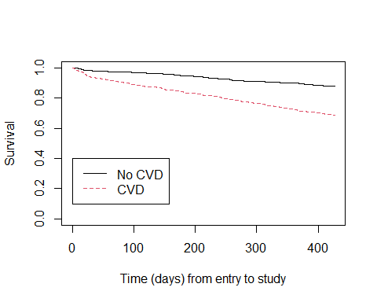

The Association Between Serum Albumin and the Risk of Mortality in
Patients with End-Stage Renal Disease
================
Mustapha Ayle
3/24/2023

# 1 Introduction

Chronic kidney disease (CKD) is a common and serious medical condition
that affects a large number of individuals worldwide. CKD is
characterized by a progressive decline in kidney function, which can
eventually lead to end-stage renal disease (ESRD) - a condition where
the kidneys are no longer able to sustain life. Hemodialysis is a
standard treatment for ESRD patients who are not eligible for kidney
transplantation.

One of the major concerns in the management of hemodialysis patients is
the identification and monitoring of nutritional status. Protein-energy
malnutrition (PEM) is a common problem in hemodialysis patients and has
been associated with increased mortality rates. One common biomarker
used to measure a patient’s PEM and overall health is serum albumin.

In this paper, we analyze a study conducted to measure the change in
serum albumin levels over time in patients with ESRD. We have three
primary questions of interest we wish to address. First, using only the
patients’ baseline albumin measurements, we want to determine the
association between serum albumin and the risk of mortality in patients
with ESRD. We will also explore whether this association differs between
patients with and without cardiovascular disease. We will then repeat
the analysis treating albumin as a time-dependent factor and study the
relationship between mortality and albumin as it changes over time.
Answering these questions will provide valuable insights into the use of
serum albumin as a potential biomarker for predicting mortality in
hemodialysis patients.

# 2 Methods

## 2.1 Data Description

The data analyzed here was collected from the National Institute of
Diabetes and Digestive and Kidney Diseases (NIDDK). A random sample of
*N* = 1, 979 patients were recruited to an observational study from
dialysis clinics across the United States undergoing dialysis therapy
during the month of December 2014.

Several data points are collected with each patients entry to the study,
including age, gender, race, smoking history, BMI, cardiovascular
disease history, diabetes history, subjective assessment of nutritional
status, and laboratory measurements related to cardiovascular health. A
detailed description of the dataset is given in Table 6 in the Appendix
B. The time origin of this study is the patients’ entry to the study and
the time scale is days since entry. The failure event is death of the
patient from ESRD.

The primary focus of this study is the relationship between serum
albumin and mortality, so in addition to the initial measurement take,
the patients’ albumin levels were measured and recorded every 1-2 months
for up to one year following the start of the study.

An important part of the dataset to identify prior to modeling are the
features we believe will have an impact on mortality. In order to
isolate the effect of albumin, we include in the model the variables we
believe to be confounders. From the features available in Table 6, the
ones that are believed to be related to both the predictors of interest
(albumin) and outcome (mortality) are age, gender, race, BMI, smoking
history, diabetes history, CVD history, whether they appeared
undernourished, and how long they had ESRD before entering the study. In
addition, we include the patients’ cholesterol and post-dialysis
systolic blood pressure (SBP) as precision variables, since they are
known to associated with cardiovascular disease.

## 2.2 Statistical Methods

In this analysis, we have three primary questions of interest:

1.  Quantify the association between baseline serum albumin and the risk
    of mortality.
2.  Quantify the potential difference in the association between
    baseline albumin and the risk of mortality comparing patients with
    and without a history of cardiovascular disease.
3.  Quantify the association between serum albumin as a time-dependent
    variable and the risk of mortality.

These question will be addressed using Cox’s proportional hazards model.
For question (1), we fit the model with baseline serum albumin as the
main effect while adjusting for the confounders discussed in the
previous section. Denoting the confounders as *Z*, the model will be

*λ*(*t*) = *λ*0(*t*) ⋅ *e**β*1 ⋅ alb0*i* + *β⃗**T**Z**i*

Question (2) uses a similar model to (1), with the addition of an
interaction term between baseline albumin and CVD history. The updated
model for this question is

*λ*(*t*) = *λ*0(*t*) ⋅ *e**β*1 ⋅ alb0*i* + *β*2 ⋅ CVD*i* + *β*3 ⋅ alb0*i* ⋅ CVD*i* + *β⃗**T**Z**i*
In question (3), we are interested in seeing how the change in albumin
at each visit is associated with mortality. Since serum albumin is a
marker for overall health, we would expect for the odds of mortality to
increase as this value decreases. To study this we extend the model used
in (2) by making albumin a time-dependent covariate and incorporating
the full dataset. The final model is shown below. Here
alb*i*(*t*) is the serum albumin value of the *i*th patient
at time *t*.

*λ*(*t*) = *λ*0(*t*) ⋅ *e**β*1 ⋅ alb*i*(*t*) + *β*2 ⋅ CVD*i* + *β⃗**T**Z**i*

Several diagnostic tests are used to assess the appropriateness of the
models. To address the proportionality assumption of the Cox models, we
examine the scaled Schoenfeld residuals. The deviance residuals and
delta-beta residuals are used to diagnose outliers and influential
observations. All model building and analysis was done using R.

# 3 Results

## 3.1 Descriptive Statistics

The first aspect of the dataset to inspect is the presence of missing
data. Of the 1,979 patients in the data, 745 (37%) contain missing
values. Measurements of serum triglyceride are missing in about 20% of
subjects, the most of any variable. As a large portion of observations
are missing triglyceride measurements, this will be excluded from the
model. With this feature excluded, only 556 (28%) are missing data.
Other features with missing values are smoking history, CVD history,
cholesterol, and undernourishment status with 9%, 8%, 7.5% and 6%
missing observations, respectively. A full breakdown of the missing data
is shown in Table 7 in Appendix B.

For the purpose of this analysis, we will be excluding patients with
missing values. Doing so results in a sample that closely follows our
initial dataset, which can be seen by comparing Table 1 with Table 8 in
Appendix B.

Table 1 provides summary statistics of all the variables in this data
stratified by if the patient was observed to die. Here we observe some
big differences between the two groups. Of the 1,423 patients with
complete observations in this study, 332 (23%) are observed to die with
an average time to death of 195 days after entering the study. Patients
who died were more likely to be older and Caucasian. Death was also more
common among current smokers and diabetics. A significant number of
patients that died had a history of CVD (80%) compared to those that did
not die (54%). Table 9 in Appendix B shows these summary statistics
further stratified by CVD history.

The data contains 332 events out of the 1,423 complete observations.
Since we have imbalanced data with somewhat rare events, a secondary
analysis will be conducted using a nested case-control design with
*M* = 4 controls per case. This analysis can be seen in Appendix A.

|                       | No Event       | Event           |
|:----------------------|:---------------|:----------------|
| n                     | 1091           | 332             |
| tdeath (mean (SD))    | 426.83 (5.66)  | 195.89 (131.69) |
| age (mean (SD))       | 57.78 (15.42)  | 66.98 (13.09)   |
| female = 1 (%)        | 529 (48.5)     | 158 (47.6)      |
| racegrp (%)           |                |                 |
| 1                     | 534 (48.9)     | 211 (63.6)      |
| 2                     | 474 (43.4)     | 102 (30.7)      |
| 3                     | 83 (7.6)       | 19 (5.7)        |
| smokegrp (%)          |                |                 |
| 1                     | 626 (57.4)     | 169 (50.9)      |
| 2                     | 307 (28.1)     | 101 (30.4)      |
| 3                     | 158 (14.5)     | 62 (18.7)       |
| hist.cvd = 1 (%)      | 590 (54.1)     | 266 (80.1)      |
| diabetes = 1 (%)      | 376 (34.5)     | 129 (38.9)      |
| esrdtime (mean (SD))  | 3.16 (3.66)    | 2.57 (2.88)     |
| undnour = 1 (%)       | 140 (12.8)     | 115 (34.6)      |
| bmi (mean (SD))       | 25.13 (5.77)   | 23.54 (6.05)    |
| albumin.0 (mean (SD)) | 3.78 (0.47)    | 3.58 (0.49)     |
| cholest (mean (SD))   | 177.33 (46.87) | 168.90 (51.23)  |
| pst.sbp (mean (SD))   | 135.85 (21.66) | 132.87 (20.82)  |

Summary Statistics Stratified by Death, Complete Observations

Another question of interest is to find the difference in the
association between baseline albumin and the risk of mortality in
patients with and without a history of CVD. Figure 1 shows a
Kaplan-Meier plot of the time to death between these two groups. It
shows that at all times, patients with a history of CVD have a higher
risk of mortality.

## 3.2 Modeling Time to Death by Baseline Serum Albumin

To analyze the association between baseline serum albumin and the risk
of mortality, we construct a Cox proportional hazard model adjusting for
the following covariates: age, gender, race, smoking history, diabetes
status, CVD history, BMI, and time with ESRD prior to entering the
study. The main effect of interest in this model is baseline albumin.

Table 2 presents the hazard ratio estimates, 95% confidence intervals,
standard errors, and p-values of the model specified above. From the
model, we estimate that the relative risk of death is approximately 37%
lower (95% CI: 20% - 51%) for a patient with a baseline albumin
measurement one unit higher than another similar patient with respect to
the features accounted for. This value has a corresponding p-value of
0.0001, meaning that it is significantly associated with the relative
risk of death given the presence of the other predictors in the model.

Some other notable features in this model are the effects of CVD history
and undernourishment. Subjects with a history of cardiovascular disease
have a relative risk of death 2.15 times higher (95% CI: 1.62-2.85) than
that of a patient without a history of cardiovascular disease who are
similar with respect to all other controlled features. Patients’ history
of CVD will be examined further in the following section. Subjects who
appeared undernourished to the study nurse at the time of entry have a
relative risk of 2.04 times (95% CI: 1.59-2.63) that of a similar
subject that appeared relatively healthy with equal values for all other
features. Values for the remaining coefficients can be seen in Table 2.

|                   | exp(coef) | exp(-coef) | lower .95 | upper .95 |  se(coef) | Pr(>\|z\|) |
|:------------------|----------:|-----------:|----------:|----------:|----------:|-----------:|
| albumin.0         | 0.6368043 |  1.5703413 | 0.4989722 | 0.8127099 | 0.1244471 |  0.0002874 |
| age               | 1.0322847 |  0.9687250 | 1.0228514 | 1.0418050 | 0.0046839 |  0.0000000 |
| female            | 0.9392887 |  1.0646354 | 0.7414503 | 1.1899156 | 0.1206730 |  0.6037428 |
| factor(racegrp)2  | 0.7983074 |  1.2526503 | 0.6250007 | 1.0196703 | 0.1248701 |  0.0712364 |
| factor(racegrp)3  | 0.8057860 |  1.2410242 | 0.4989875 | 1.3012172 | 0.2445133 |  0.3771659 |
| factor(smokegrp)2 | 0.8557775 |  1.1685280 | 0.6554383 | 1.1173517 | 0.1360771 |  0.2524023 |
| factor(smokegrp)3 | 1.5202965 |  0.6577664 | 1.1106377 | 2.0810580 | 0.1601922 |  0.0089223 |
| diabetes          | 1.1982505 |  0.8345501 | 0.9452786 | 1.5189218 | 0.1209911 |  0.1349557 |
| hist.cvd          | 2.2064096 |  0.4532250 | 1.6637496 | 2.9260675 | 0.1440296 |  0.0000000 |
| esrdtime          | 1.0030276 |  0.9969815 | 0.9678686 | 1.0394638 | 0.0182054 |  0.8681157 |
| undnour           | 2.0310264 |  0.4923619 | 1.5787775 | 2.6128244 | 0.1285179 |  0.0000000 |
| bmi               | 0.9805789 |  1.0198058 | 0.9578443 | 1.0038531 | 0.0119685 |  0.1012863 |
| cholest           | 0.9978290 |  1.0021757 | 0.9954289 | 1.0002350 | 0.0012287 |  0.0769327 |
| pst.sbp           | 0.9944658 |  1.0055650 | 0.9891744 | 0.9997855 | 0.0027220 |  0.0414744 |

Coeffients Modeling Mortality with Baseline Albumin

Figure 2 in Appendix B shows a set of diagnostic plots for this model.
To ensure that we have the correct functional form for serum albumin, we
examine the Martingale residual plot. The fitted line here appears
centered around zero, so we maintain the identity for for albumin and
conclude that the effect is linear. To assess the proportional hazards
assumption, we examine the scaled Schoenfeld residuals. The plot of
these residuals shows that the points are centered around zero and
appear to satisfy the proportionality assumption.

There are 4 outliers found from the deviance residuals: patients 26890,
150948, 555425, and 589114. ID 26890 had a very high BMI of 47.6 and had
ESRD for 5.6 years prior to entering the study. IDs 150948, 555425, and
589114 all died shortly after joining the study, with ID 150948 and
555425 dying one day later and ID 589114 two days later. When looking at
the delta-beta values, Subject 565977 was found to be the only highly
influential observation. This subject had the highest baseline serum
albumin measurement of those observed to die and had a very late time of
death. None of the outliers identified as influential because the hazard
at early failure times is likely not too different since most subjects
are still present in the risk set.

## 3.3 Modeling Time to Death by Baseline Serum Albumin and CVD

To study the difference in the association between baseline albumin and
mortality comparing patients with and without a history of CVD, we
extend the proportional hazards model from the previous section by
adding an interaction term for the patients’ CVD history and baseline
albumin.

Table 3 shows the relative risk of death associated with having a
history of CVD for patients at three representative albumin levels in
the dataset. For patients with a baseline albumin value of 3.5, the
estimated relative risk associated with having a history of CVD is 2.14
times (95% CI: 1.56-2.93) when compared to no history of CVD. This risk
appears to increase for higher albumin values. In patients with a
baseline albumin of 4, the estimated risk of death associated with
history of CVD is 2.64 times (95% CI: 1.76-3.94). All estimates are
adjusted for age, gender, race, smoking history, diabetes, time with
ESRD, BMI, cholesterol, and SBP.

Conducting a likelihood ratio test comparing this model to the previous
one without an interaction yields a chi-squared statistic of 2.7 on 1
degree of freedom with a p-value of 0.10. So this interaction does not
provide a significant improvement to the model. The full estimated
coefficients and confidence intervals of this model are shown in Table
10 in Appendix B.

|                | Estimated RR | lower .95 | upper .95 |  pva1 |
|:---------------|-------------:|----------:|----------:|------:|
| Albumin0 = 3.5 |     2.142760 |  1.562877 |  2.937801 | 2e-07 |
| Albumin0 = 3.8 |     2.426356 |  1.719721 |  3.423346 | 0e+00 |
| Albumin0 = 4.0 |     2.635977 |  1.766106 |  3.934291 | 2e-07 |

Estimates for the RR of Death in patients with history of CVD, modified
by baseline albumin

Figure 3 in Appendix B shows a set of diagnostic plots for this model.
These plots are very similar to the ones found in Figure 2, that were
discussed in (3.2). We see from the two scaled Schoenfeld residuals
plots that the proportionality assumption appears to be satisfied. From
the deviance residuals, we find the same 4 observations to be outliers
as in the model from (3.2). For the delta-beta values, ID 583571 was
found to be influential in terms of both baseline albumin and CVD
history. None of the outliers identified as influential because the
hazard at early failure times is likely not too different since most
subjects are still present in the risk set.

## 3.4 Serum Albumin as a Time-Dependent Covariate

Given the studies focus on albumin, additional measurements were taken
and recorded for each patients every 1-2 months for up to one year
following the start of the study. To examine how the change in albumin
at each visit is associated with mortality, we will refit the model and
incorporate this new data by considering albumin as a time-dependent
covariate.

Based on the model results in Table 4, we estimate that, at any given
time *t*, the relative risk of death is approximately 69% lower (95% CI:
61% - 76%) for a patient with serum albumin one unit higher than another
similar patient at the same time *t*. With a p-value \< 0.001, this
suggests that higher serum albumin levels are associated with a reduced
risk of death in hemodialysis patients. The relative risk of death for
former smokers is approximately 0.87 times (95% CI: 0.67-1.14) that of
similar patients who have never smoked. For current smokers, the
relative risk is 1.51 times (95% CI: 1.11-2.08) that of similar patients
who have never smoked. Patients with a history of CVD have an estimated
relative risk of death of 2.15 times (95% CI: 1.63-2.85) that of another
group of patients without a history of CVD. Patients who appeared
undernourished during their first visit have an estimated relative risk
of 1.78 times (95% CI: 1.40-2.28) that of another group of similar
patients who did not appear undernourished. All estimates are adjusted
for serum albumin, age, gender, race, smoking history, diabetes, time
with ESRD, undernourishment, BMI, CVD history, cholesterol, and SBP. The
remaining estimated relative risks of the model are presented in Table 4
below.

|                   | exp(coef) | exp(-coef) | lower .95 | upper .95 |  se(coef) | Pr(>\|z\|) |
|:------------------|----------:|-----------:|----------:|----------:|----------:|-----------:|
| albumin           | 0.3112353 |  3.2130032 | 0.2461615 | 0.3935116 | 0.1196763 |  0.0000000 |
| age               | 1.0313383 |  0.9696140 | 1.0220317 | 1.0407296 | 0.0046250 |  0.0000000 |
| female            | 0.9167711 |  1.0907848 | 0.7234961 | 1.1616777 | 0.1207995 |  0.4719238 |
| factor(racegrp)2  | 0.8072416 |  1.2387865 | 0.6322870 | 1.0306064 | 0.1246348 |  0.0857823 |
| factor(racegrp)3  | 0.7497115 |  1.3338465 | 0.4649781 | 1.2088039 | 0.2437280 |  0.2372378 |
| factor(smokegrp)2 | 0.8726936 |  1.1458775 | 0.6678049 | 1.1404440 | 0.1365272 |  0.3185757 |
| factor(smokegrp)3 | 1.5149442 |  0.6600903 | 1.1058212 | 2.0754314 | 0.1606103 |  0.0097026 |
| diabetes          | 1.1350356 |  0.8810297 | 0.8941542 | 1.4408094 | 0.1217069 |  0.2980009 |
| hist.cvd          | 2.1537730 |  0.4643015 | 1.6254893 | 2.8537489 | 0.1435804 |  0.0000001 |
| esrdtime          | 1.0037141 |  0.9962997 | 0.9684697 | 1.0402411 | 0.0182378 |  0.8389230 |
| undnour           | 1.7828423 |  0.5609021 | 1.3952535 | 2.2780998 | 0.1250700 |  0.0000038 |
| bmi               | 0.9778482 |  1.0226536 | 0.9552319 | 1.0009999 | 0.0119391 |  0.0606203 |
| cholest           | 0.9982003 |  1.0018029 | 0.9959194 | 1.0004864 | 0.0011672 |  0.1227545 |
| pst.sbp           | 0.9947040 |  1.0053242 | 0.9894999 | 0.9999354 | 0.0026763 |  0.0472444 |

Coeffients Modeling Mortality with Time-Dependent Albumin

Comparing the results of this model to that found in (3.2), we see that
many of the coefficients have very similar values, with the exception of
albumin. In (3.2), the model considers only the baseline serum albumin
levels. This approach assumes that the serum albumin levels remain
constant for each patient throughout the study period, which may not
reflect the true variability in albumin levels experienced by the
patients over time. The model in this section takes into account the
time-dependent nature of serum albumin and is able to better reflect the
changes in albumin levels over time and capture the impact of these
fluctuations on the risk of mortality.

Figure 4 in Appendix B shows a set of diagnostic plots for this model.
The scaled Schoenfeld residuals for albumin against time indicate that
the proportionality assumption is not violated. Examining the deviance
residuals we find 21 observations with values greater than 3 that we
classify as outliers. Two observations were found to be influential
using delta-beta criteria. The only observation found to be both
influential and an outlier is ID 320843.

# 4 Discussion

This study aimed to investigate the association between serum albumin
levels and the risk of mortality in patients with end-stage renal
disease (ESRD) undergoing hemodialysis. The results of our analysis
suggest that serum albumin is a significant predictor of mortality and
that patients with higher serum albumin levels were found to have a
lower risk of mortality. This relationship remained significant after
adjusting for potential confounders such as age, gender, race, smoking
history, diabetes, time with ESRD, undernourishment, BMI, CVD history,
cholesterol, and SBP.

Our analysis also explored the potential difference in the association
between baseline albumin and the risk of mortality comparing patients
with and without a history of CVD. Although we observed some differences
in the estimated risk of death associated with CVD history for different
albumin levels, the interaction between baseline albumin and CVD history
was not statistically significant.

When treating albumin as a time-dependent covariate, our results
indicated that the association between albumin and mortality risk
remained significant, and even stronger than when only considering
baseline albumin measurements. This finding highlights the importance of
monitoring serum albumin levels throughout the course of hemodialysis
treatment, as changes in albumin levels over time might have a
significant impact on patient outcomes.

There were two main limitations in this analysis. First is the
considerable amount of missing data and patients excluded from the
analysis. This may have resulted in selection bias and affected the
generalizability of our findings. Second is that the study focuses on
only a single biomarker (serum albumin) to assess nutritional status and
risk of mortality. Future studies could consider evaluating the impact
of additional biomarkers to improve risk estimation and patient
profiling.

# Appendix A

## Case-Control Study

As noted in part (3.1), we will conduct a secondary analysis for the
association between baseline serum albumin and the risk of mortality
accounting for the imbalanced data. For this we use a nested
case-control study. This design allows us to sample all cases and only
sample a portion matched controls. We match the controls to cases based
on baseline albumin, age, gender, race, smoking history, diabetes, CVD
history, time with ESRD, undernourishment, BMI, cholesterol, and SBP to
minimize selection bias and ensure the results are as valid and reliable
as possible. Here we will be using *M* = 4 controls per case. The nested
case-control analysis is performed using a conditional logistic
regression analysis.

Table 5 shows the results of the case-control design model. The odds of
death is approximately 41% lower (95% CI: 22%-56%) for a patient with a
baseline albumin measurement one unit higher than another similar
patient. Patients with a history of CVD have 2.25 times (95% CI:
1.64-3.08) the risk of death compared to a similar patient without a
history of CVD. Patients who appeared undernourished to the study nurse
at the time of entry have 1.86 times (95% CI: 1.36-2.56) the risk of
death compared to a similar patient that appeared relatively healthy.
All estimates are adjusted for age, gender, race, smoking history,
diabetes, time with ESRD, BMI, cholesterol, and SBP.

Comparing to the estimates of this model to those found in (3.2), we see
that the results of the two models are very similar. We also see that,
across all coefficients, we have larger values for the standard errors.
Note that the standard errors of our coefficients in the case-control
design are larger than when we used the full sample. This reflects the
loss of information due to the reduced number of controls. The
confidence intervals of our estimates are also wider as a result. The
relative efficiency of the full design relative to the case-control
design is *M* + 1/*M* = 1.25.

|           | exp(coef) | exp(-coef) | lower .95 | upper .95 |  se(coef) | Pr(>\|z\|) |
|:----------|----------:|-----------:|----------:|----------:|----------:|-----------:|
| albumin.0 | 0.5862550 |  1.7057423 | 0.4408585 | 0.7796037 | 0.1454266 |  0.0002407 |
| age       | 1.0293081 |  0.9715264 | 1.0183021 | 1.0404330 | 0.0054849 |  0.0000001 |
| female    | 1.0008840 |  0.9991167 | 0.7565545 | 1.3241199 | 0.1427906 |  0.9950623 |
| racegrp   | 0.7811627 |  1.2801430 | 0.6258628 | 0.9749983 | 0.1130900 |  0.0289731 |
| smokegrp  | 1.1555859 |  0.8653619 | 0.9548398 | 1.3985369 | 0.0973585 |  0.1374620 |
| diabetes  | 1.1655707 |  0.8579488 | 0.8774712 | 1.5482617 | 0.1448608 |  0.2902188 |
| hist.cvd  | 2.2520588 |  0.4440381 | 1.6453289 | 3.0825259 | 0.1601583 |  0.0000004 |
| esrdtime  | 1.0138881 |  0.9863021 | 0.9707301 | 1.0589649 | 0.0221940 |  0.5343005 |
| undnour   | 1.8638288 |  0.5365300 | 1.3565758 | 2.5607546 | 0.1620791 |  0.0001223 |
| bmi       | 0.9783726 |  1.0221055 | 0.9538655 | 1.0035093 | 0.0129430 |  0.0911611 |
| cholest   | 0.9975950 |  1.0024108 | 0.9948009 | 1.0003970 | 0.0014310 |  0.0924477 |
| pst.sbp   | 0.9947901 |  1.0052372 | 0.9882762 | 1.0013469 | 0.0033519 |  0.1191378 |

Coeffients for Case-Control Design

# Appendix B

| variable  | n_miss |   pct_miss |
|:----------|-------:|-----------:|
| trigly    |    392 | 19.8079838 |
| smokegrp  |    177 |  8.9439111 |
| hist.cvd  |    161 |  8.1354219 |
| cholest   |    147 |  7.4279939 |
| undnour   |    120 |  6.0636685 |
| bmi       |     41 |  2.0717534 |
| pst.sbp   |     32 |  1.6169783 |
| racegrp   |     30 |  1.5159171 |
| diabetes  |      9 |  0.4547751 |
| usrds.id  |      0 |  0.0000000 |
| tdeath    |      0 |  0.0000000 |
| death     |      0 |  0.0000000 |
| age       |      0 |  0.0000000 |
| female    |      0 |  0.0000000 |
| esrdtime  |      0 |  0.0000000 |
| albumin.0 |      0 |  0.0000000 |

Distribution of Missing Data

|                       | No Event       | Event           |
|:----------------------|:---------------|:----------------|
| n                     | 1091           | 332             |
| tdeath (mean (SD))    | 426.83 (5.66)  | 195.89 (131.69) |
| age (mean (SD))       | 57.78 (15.42)  | 66.98 (13.09)   |
| female = 1 (%)        | 529 (48.5)     | 158 (47.6)      |
| racegrp (%)           |                |                 |
| 1                     | 534 (48.9)     | 211 (63.6)      |
| 2                     | 474 (43.4)     | 102 (30.7)      |
| 3                     | 83 (7.6)       | 19 (5.7)        |
| smokegrp (%)          |                |                 |
| 1                     | 626 (57.4)     | 169 (50.9)      |
| 2                     | 307 (28.1)     | 101 (30.4)      |
| 3                     | 158 (14.5)     | 62 (18.7)       |
| hist.cvd = 1 (%)      | 590 (54.1)     | 266 (80.1)      |
| diabetes = 1 (%)      | 376 (34.5)     | 129 (38.9)      |
| esrdtime (mean (SD))  | 3.16 (3.66)    | 2.57 (2.88)     |
| undnour = 1 (%)       | 140 (12.8)     | 115 (34.6)      |
| bmi (mean (SD))       | 25.13 (5.77)   | 23.54 (6.05)    |
| albumin.0 (mean (SD)) | 3.78 (0.47)    | 3.58 (0.49)     |
| cholest (mean (SD))   | 177.33 (46.87) | 168.90 (51.23)  |
| pst.sbp (mean (SD))   | 135.85 (21.66) | 132.87 (20.82)  |

Summary Statistics Stratified by Death, All Observations

|                       | No Event, No CVD | No Event, CVD  | Event, No CVD   | Event, CVD      |
|:----------------------|:-----------------|:---------------|:----------------|:----------------|
| n                     | 501              | 590            | 66              | 266             |
| tdeath (mean (SD))    | 427.00 (0.00)    | 426.68 (7.70)  | 221.58 (128.81) | 189.52 (131.86) |
| age (mean (SD))       | 53.02 (16.41)    | 61.82 (13.27)  | 63.24 (14.74)   | 67.91 (12.50)   |
| female = 1 (%)        | 235 (46.9)       | 294 (49.8)     | 26 (39.4)       | 132 (49.6)      |
| racegrp (%)           |                  |                |                 |                 |
| 1                     | 231 (46.1)       | 303 (51.4)     | 38 (57.6)       | 173 (65.0)      |
| 2                     | 235 (46.9)       | 239 (40.5)     | 27 (40.9)       | 75 (28.2)       |
| 3                     | 35 (7.0)         | 48 (8.1)       | 1 (1.5)         | 18 (6.8)        |
| smokegrp (%)          |                  |                |                 |                 |
| 1                     | 322 (64.3)       | 304 (51.5)     | 39 (59.1)       | 130 (48.9)      |
| 2                     | 106 (21.2)       | 201 (34.1)     | 14 (21.2)       | 87 (32.7)       |
| 3                     | 73 (14.6)        | 85 (14.4)      | 13 (19.7)       | 49 (18.4)       |
| diabetes = 1 (%)      | 123 (24.6)       | 253 (42.9)     | 17 (25.8)       | 112 (42.1)      |
| esrdtime (mean (SD))  | 3.48 (3.99)      | 2.89 (3.33)    | 2.66 (3.24)     | 2.55 (2.78)     |
| undnour = 1 (%)       | 55 (11.0)        | 85 (14.4)      | 23 (34.8)       | 92 (34.6)       |
| bmi (mean (SD))       | 24.80 (5.75)     | 25.40 (5.77)   | 24.04 (6.39)    | 23.41 (5.96)    |
| albumin.0 (mean (SD)) | 3.84 (0.48)      | 3.73 (0.46)    | 3.52 (0.47)     | 3.60 (0.49)     |
| cholest (mean (SD))   | 177.19 (44.75)   | 177.44 (48.63) | 170.62 (53.77)  | 168.48 (50.68)  |
| pst.sbp (mean (SD))   | 133.98 (21.67)   | 137.45 (21.53) | 131.03 (17.25)  | 133.33 (21.62)  |

Summary Statistics Stratified by Death and CVD

|                    | exp(coef) | exp(-coef) | lower .95 | upper .95 |  se(coef) | Pr(>\|z\|) |
|:-------------------|----------:|-----------:|----------:|----------:|----------:|-----------:|
| albumin.0          | 0.4733857 |  2.1124425 | 0.3120377 | 0.7181632 | 0.2126501 |  0.0004368 |
| hist.cvd           | 0.5025704 |  1.9897708 | 0.0877500 | 2.8783713 | 0.8904470 |  0.4397192 |
| age                | 1.0321998 |  0.9688047 | 1.0227275 | 1.0417599 | 0.0047038 |  0.0000000 |
| female             | 0.9397171 |  1.0641501 | 0.7414110 | 1.1910643 | 0.1209327 |  0.6071536 |
| factor(racegrp)2   | 0.7993495 |  1.2510173 | 0.6256797 | 1.0212247 | 0.1249817 |  0.0731460 |
| factor(racegrp)3   | 0.8131830 |  1.2297355 | 0.5034785 | 1.3133958 | 0.2446040 |  0.3978627 |
| factor(smokegrp)2  | 0.8513028 |  1.1746701 | 0.6517583 | 1.1119405 | 0.1362750 |  0.2374669 |
| factor(smokegrp)3  | 1.5111715 |  0.6617383 | 1.1037116 | 2.0690544 | 0.1603124 |  0.0100094 |
| diabetes           | 1.2031846 |  0.8311277 | 0.9493249 | 1.5249290 | 0.1209083 |  0.1260534 |
| esrdtime           | 1.0054989 |  0.9945311 | 0.9700416 | 1.0422523 | 0.0183168 |  0.7646420 |
| undnour            | 2.0290354 |  0.4928450 | 1.5766087 | 2.6112912 | 0.1287189 |  0.0000000 |
| bmi                | 0.9798233 |  1.0205922 | 0.9572320 | 1.0029477 | 0.0119015 |  0.0867765 |
| cholest            | 0.9979253 |  1.0020790 | 0.9955106 | 1.0003459 | 0.0012361 |  0.0929277 |
| pst.sbp            | 0.9947555 |  1.0052722 | 0.9894588 | 1.0000805 | 0.0027239 |  0.0535555 |
| albumin.0:hist.cvd | 1.5133389 |  0.6607905 | 0.9306706 | 2.4608003 | 0.2480496 |  0.0948591 |

Coeffients Modeling Mortality With Baseline Albumin and CVD Interaction

